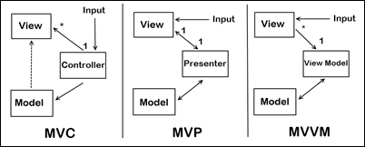

# MVC, MVP, MVVM

## 1.MVC
- 모델, 뷰, 컨트롤러의 약자
- 뷰와 모델을 나누고 둘을 컨트롤하는 컨트롤러를 만듦
- 인풋도 컨트롤러를 통해 받아서 뷰와 모델을 변경

## 2.MVP
- 모델, 뷰, 프레젠터의 약자
- ios의 경우 프로그래밍하는데 있어서 '뷰컨트롤러'를 만들기 때문에 뷰와 컨트롤러의 구분이 애매함
- 그냥 뷰 컨트롤러까지 뷰로 보고 뷰마다 그 뷰를 컨트롤하는 프레전터를 만들어서 변경
- 인풋은 뷰를 통해 받아서 프레젠터를 통해 모델을 변경

## 3.MVVM
- 뷰모델, 뷰, 모델의 약자
- MVP에서는 뷰와 프레젠터의 관계가 1:1이다보니 비슷한 뷰끼리는 같이 묶어서 관리하고 싶어짐
- 뷰모델을 통해 모델을 바꾸는데 뷰모델이 뷰를 바꾸는 것이 아니라, 뷰에 인풋이 들어오면 뷰모델을 통해서 모델을 변경함.
- 뷰는 변경된 모델에 따라서 변경된 뷰모델 값을 보고 '알아서' 바뀐다.